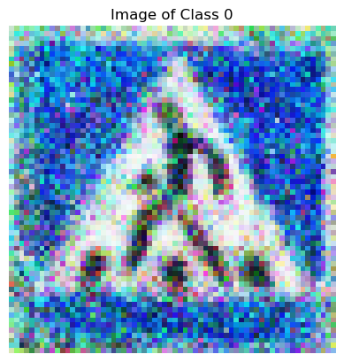
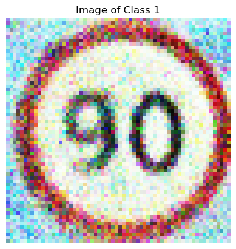
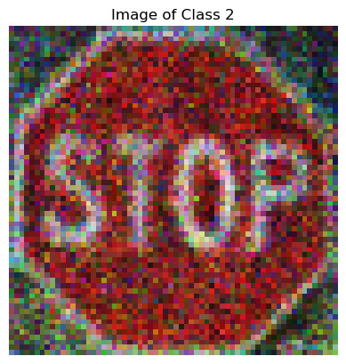
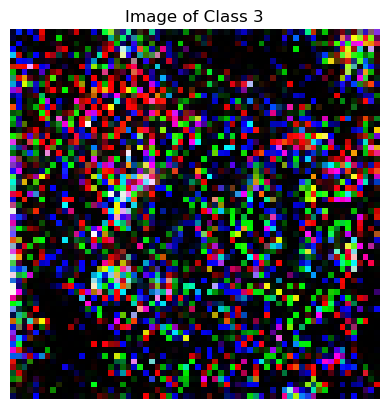

# Road Sign Detection and Generation with Machine Learning
   
## Overview

This project aims to develop machine learning models for detecting and classifying road signs in images, an essential task for advanced driver assistance systems, autonomous vehicles, and traffic monitoring. Additionally, we explore generative modeling to create new road sign images using Conditional Generative Adversarial Networks (cGANs).

---

## Table of Contents

1. [Problem Description](#problem-description)
2. [Model Comparison](#model-comparison)
3. [Training Size Analysis](#training-size-analysis)
4. [Stretch Goal: Generative Innovation](#stretch-goal-generative-innovation)
5. [Acknowledgments & Resources](#acknowledgments--resources)

---

## Problem Description

We address the challenge of classifying road signs into four categories: `Traffic Light`, `Stop`, `Speed Limit`, and `Crosswalk`, using labeled images with bounding boxes in the PASCAL VOC format.

### Experimental Setup
- **Dataset Size:** 877 images
- **Data Split:** 70% training, 15% validation, 15% testing
- **Metrics:** Accuracy
- **Challenges:** Class imbalance, with a significant majority in the `Speed Limit` class.

---

## Model Comparison

We evaluated three models with varying hyperparameters:

### Logistic Regression
- Tested hyperparameters: `C`, `penalty`, `solver`, `multi_class`
- Best result: `C=1`, `penalty=L2`, `solver=saga`, `multi_class=multinomial`

### Support Vector Machines (SVM)
- Tested hyperparameters: `C`, `kernel`, `gamma`
- Best result: `C=10`, `kernel=RBF`, `gamma=scale`

### ResNet50
- Tested hyperparameters: `learning rate`, `batch size`, `scheduler`, `optimizer`
- Best result: `lr=0.001`, `batch size=8`, `scheduler=StepLR`, `optimizer=SGD`

### Overall Best Model
The ResNet50 model achieved nearly **100% accuracy** with the optimal hyperparameters.

---

## Training Size Analysis

We analyzed the effect of training data size on model performance. Results showed significant improvements with increased training data, but marginal gains beyond 50%, indicating the simplicity of the dataset with only four broad classes.

---

## Stretch Goal: Generative Innovation

We implemented a Conditional Generative Adversarial Network (cGAN) to generate road sign images based on class labels.

### Approach
- Adapted a basic cGAN for MNIST to handle road sign images.
- Adjusted latent dimensions, transforms, and architecture for our dataset.
- Evaluated the model qualitatively by examining generated images.

### Challenges & Innovations
- Initial results were pixelated; improvements were made by adding layers and increasing epochs.
- Our work demonstrates a shift toward **generative modeling**, aligning with modern AI trends.

### Future Directions
- Refine the model for high-resolution image generation.
- Explore applications in areas like stock image generation and reconstruction from occlusions.
- Investigate combining ResNet50 with the cGAN for input-output image mapping using custom loss functions.

## Sample Generated Images

Here are some sample images generated by our Conditional Generative Adversarial Network (cGAN):

    
    
    
    

---

## Acknowledgments & Resources

- **Dataset:** [Kaggle Link](https://www.kaggle.com/datasets/andrewmvd/road-sign-detection)
- **cGAN Implementation:** Adapted from [CGAN-PyTorch](https://github.com/Lornatang/CGAN-PyTorch/tree/master)
- **External References:** Additional resources are cited within the report.

---

## Group Members

- **Aryan Bahl**
- **Richie Ma**
- **Ronit Anandani**

---

This project was part of **CS 441 - Final Project**, and we sincerely thank our instructors and collaborators for their guidance.